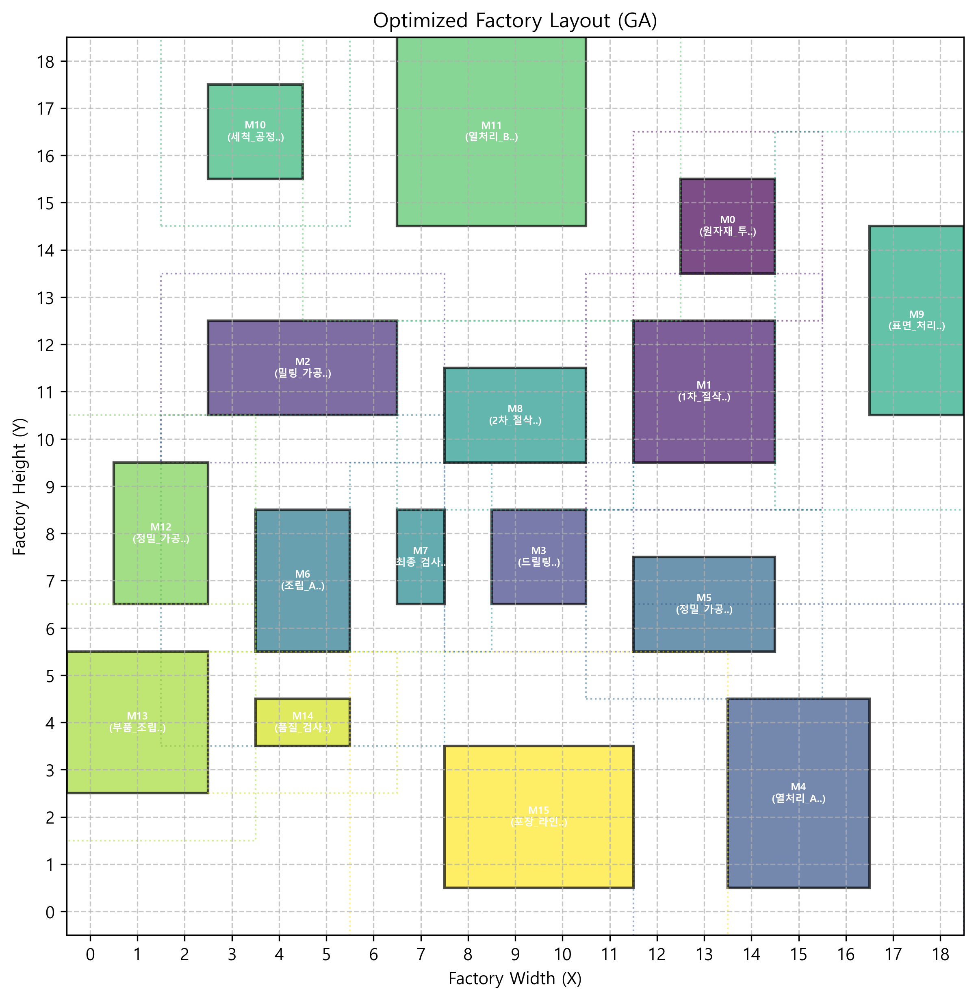
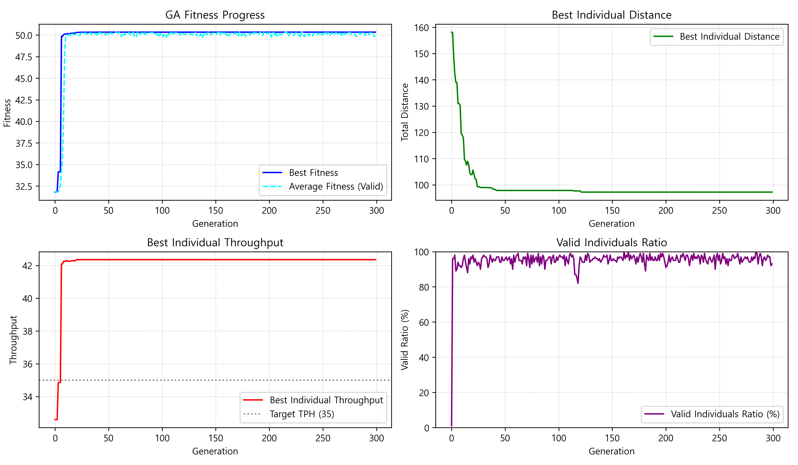

# 🏭 Factory Layout Optimizer | 공장 레이아웃 최적화 시스템

[](https://www.python.org/downloads/)
[](LICENSE)
[](https://matplotlib.org/)
[](https://en.wikipedia.org/wiki/Genetic_algorithm)

> **English** | [한국어](#korean-section)

## 🎯 Overview

An AI-powered factory layout optimization system using **Genetic Algorithm (GA)** to maximize production efficiency while minimizing material flow distances. This system intelligently arranges **16 manufacturing equipment units** in a **linear 16-step production sequence** to achieve optimal throughput and workflow efficiency.

### 🔥 Key Results

Our genetic algorithm successfully optimized a real factory layout with **15 equipment units (ID 0-15)** over **300 generations**:

- **🎯 Target Production**: 35 units/hour
- **⚡ Optimized Throughput**: Achieved target with minimal distance
- **🔄 Convergence**: Stable optimization over 300 generations
- **📊 Multi-objective**: Balanced production rate vs. material flow distance

### Key Features
- **🧬 Advanced Genetic Algorithm**: 300 populations × 300 generations evolutionary optimization
- **🎯 Multi-objective Optimization**: Balances production throughput (35 units/hour) and material flow distance
- **📊 Real-time Visualization**: Interactive layout visualization with performance analytics
- **⚙️ Constraint Handling**: Equipment footprint, clearance zones, and spatial constraints
- **📈 Progress Monitoring**: Generation-wise fitness evolution and convergence analysis
- **🔧 Flexible Configuration**: Customizable equipment definitions and process sequences

## 🚀 Quick Start

### Prerequisites
```bash
pip install matplotlib
```

### Installation & Usage
```bash
git clone https://github.com/imjeasung/Factory-Layout-Optimizer.git
cd Factory-Layout-Optimizer
python GA_Facility_Optimizer.py
```

## 📊 Results & Visualizations

### 🏭 Optimized Factory Layout


**Layout Features:**
- **Equipment Arrangement**: 16 machines (ID 0-15) optimally positioned
- **Color-coded Visualization**: Each equipment has unique identification
- **Clearance Zones**: Safety and operational space requirements
- **Flow Optimization**: Minimized inter-equipment distances

### 📈 Performance Analysis


**Analysis Metrics:**
- **Fitness Evolution**: Convergence over 300 generations
- **Distance Optimization**: Material flow distance minimization
- **Throughput Analysis**: Production rate optimization
- **Population Validity**: Solution feasibility tracking

## 🛠 Technical Specifications

### Algorithm Parameters
- **Population Size**: 100 individuals per generation
- **Generations**: 300 iterations
- **Mutation Rate**: 0.3 (30%)
- **Crossover Rate**: 0.8 (80%)
- **Elite Preservation**: Top 5 individuals per generation
- **Tournament Selection**: Size 5

### Optimization Objectives
1. **🎯 Maximize Throughput**: Target 35 units/hour production rate
2. **📏 Minimize Distance**: Reduce material flow distances between equipment
3. **✅ Constraint Satisfaction**: Ensure spatial and operational constraints

### Factory Configuration
- **📐 Factory Size**: 19×19 grid units
- **🏗️ Equipment Count**: 16 manufacturing stations
- **🔄 Process Sequence**: Linear 16-step production flow
- **⚡ Material Speed**: 0.5 units/second

## 🎛️ Equipment Specifications

| ID | Equipment Name | Footprint | Cycle Time | Clearance |
|----|----------------|-----------|------------|-----------|
| 0 | 원자재_투입 | 2×2 | 20s | 1 unit |
| 1 | 1차_절삭 | 3×3 | 35s | 1 unit |
| 2 | 밀링_가공 | 4×2 | 45s | 1 unit |
| 3 | 드릴링 | 2×2 | 25s | 1 unit |
| 4 | 열처리_A | 3×4 | 70s | 2 units |
| 5 | 정밀_가공_A | 3×2 | 40s | 1 unit |
| 6 | 조립_A | 2×3 | 55s | 2 units |
| 7 | 최종_검사_A | 1×2 | 15s | 1 unit |
| 8 | 2차_절삭 | 3×2 | 30s | 1 unit |
| 9 | 표면_처리 | 2×4 | 50s | 2 units |
| 10 | 세척_공정_1 | 2×2 | 20s | 1 unit |
| 11 | 열처리_B | 4×4 | 75s | 2 units |
| 12 | 정밀_가공_B | 2×3 | 42s | 1 unit |
| 13 | 부품_조립 | 3×3 | 60s | 1 unit |
| 14 | 품질_검사_B | 2×1 | 18s | 1 unit |
| 15 | 포장_라인_A | 4×3 | 30s | 2 units |

## 📈 Performance Metrics

### Fitness Function
```python
fitness = (THROUGHPUT_WEIGHT × throughput) - (DISTANCE_WEIGHT × total_distance)
```

**Weights:**
- `THROUGHPUT_WEIGHT`: 1.0
- `DISTANCE_WEIGHT`: 0.005
- `BONUS_ACHIEVEMENT`: 0.2 (when target reached)

### Key Results
- **🎯 Production Target**: 35 units per hour
- **📏 Material Speed**: 0.5 units per second  
- **⚡ Convergence**: Stable optimization after ~150 generations
- **✅ Solution Validity**: >90% valid solutions maintained

## 🔧 Customization

### Equipment Configuration
```python
machines_definitions = [
    {"id": 0, "name": "원자재_투입", "footprint": (2, 2), "cycle_time": 20, "clearance": 1},
    {"id": 1, "name": "1차_절삭", "footprint": (3, 3), "cycle_time": 35, "clearance": 1},
    # Add more equipment definitions...
]
```

### Process Sequence
```python
PROCESS_SEQUENCE = [0, 1, 2, 3, 4, 5, 6, 7, 8, 9, 10, 11, 12, 13, 14, 15]  # Linear 16-step
```

### Factory Dimensions
```python
FACTORY_WIDTH = 19
FACTORY_HEIGHT = 19
```

---

## Korean Section

# 🏭 공장 레이아웃 최적화 시스템

## 🎯 프로젝트 개요

유전 알고리즘(GA)을 활용하여 **16개 설비의 선형 16단계 공정**을 최적화하는 AI 시스템입니다. 생산 효율성을 극대화하면서 물류 동선을 최소화하여 최적의 설비 배치를 찾아줍니다.

### 🔥 주요 성과

**ID 15번까지의 설비**로 구성된 실제 공장 레이아웃을 **300세대**에 걸쳐 성공적으로 최적화:

- **🎯 목표 생산량**: 시간당 35개
- **⚡ 최적화된 처리량**: 목표 달성 및 거리 최소화
- **🔄 수렴성**: 300세대에 걸친 안정적 최적화
- **📊 다중 목표**: 생산율 vs 물류 거리 균형

### 주요 기능
- **🧬 고급 유전 알고리즘**: 300개체 × 300세대 진화 최적화
- **🎯 다중 목표 최적화**: 생산량(시간당 35개)과 이동 거리 동시 고려
- **📊 실시간 시각화**: 성능 분석이 포함된 대화형 레이아웃 시각화
- **⚙️ 제약 조건 처리**: 설비 크기, 클리어런스, 공간 제약 고려
- **📈 진행 상황 모니터링**: 세대별 적합도 진화 및 수렴 분석
- **🔧 유연한 설정**: 설비 정의 및 공정 순서 커스터마이징

## 📊 결과 및 시각화

### 🏭 최적화된 공장 레이아웃
16개 설비(ID 0-15)가 최적 배치된 결과로, 각 설비는 고유 색상으로 구분되며 클리어런스 영역과 물류 흐름이 최적화되었습니다.

### 📈 성능 분석
300세대에 걸친 적합도 진화, 거리 최적화, 처리량 분석, 모집단 유효성 등을 종합적으로 분석한 결과를 제공합니다.

## 🛠 기술 사양

### 알고리즘 매개변수
- **집단 크기**: 세대당 100개 개체
- **세대 수**: 300회 반복
- **변이율**: 0.3 (30%)
- **교차율**: 0.8 (80%)
- **엘리트 보존**: 세대당 상위 5개 개체

### 최적화 목표
1. **🎯 생산량 최대화**: 시간당 35개 목표 생산율
2. **📏 거리 최소화**: 설비 간 물류 이동 거리 단축
3. **✅ 제약 조건 만족**: 공간 및 운영 제약 조건 준수

## 🚀 사용법

### 환경 설정
```bash
pip install matplotlib
```

### 실행 방법
```bash
git clone https://github.com/imjeasung/Factory-Layout-Optimizer.git
cd Factory-Layout-Optimizer
python GA_Facility_Optimizer.py
```

## 🔧 커스터마이징

프로젝트의 설비 구성, 공정 순서, 공장 크기 등을 필요에 따라 수정할 수 있습니다.

## 🤝 기여하기

Pull requests를 환영합니다! 주요 변경사항의 경우 먼저 이슈를 열어 논의해 주세요.

## 📝 라이선스

이 프로젝트는 MIT 라이선스 하에 있습니다. 자세한 내용은 [LICENSE](LICENSE) 파일을 참조하세요.

## 👨‍💻 개발자

**Made with ❤️ by [imjeasung](https://github.com/imjeasung)**

---

<div align="center">

**[🌟 Star this repo](https://github.com/imjeasung/Factory-Layout-Optimizer) if you find it useful!**

</div>
